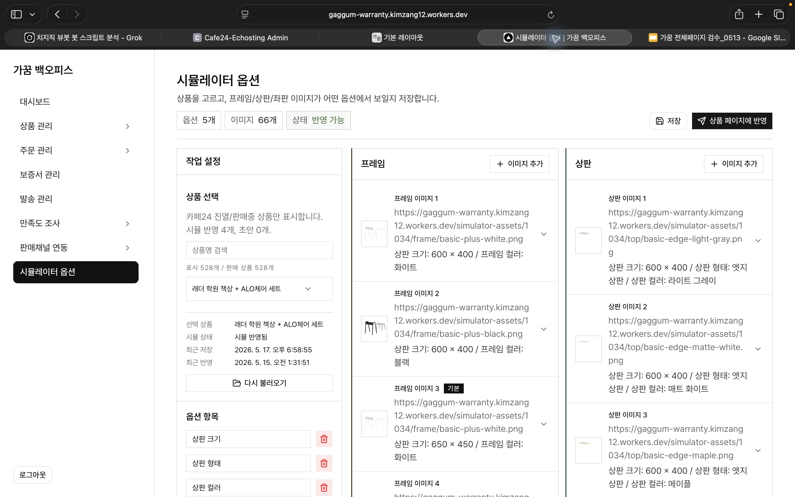
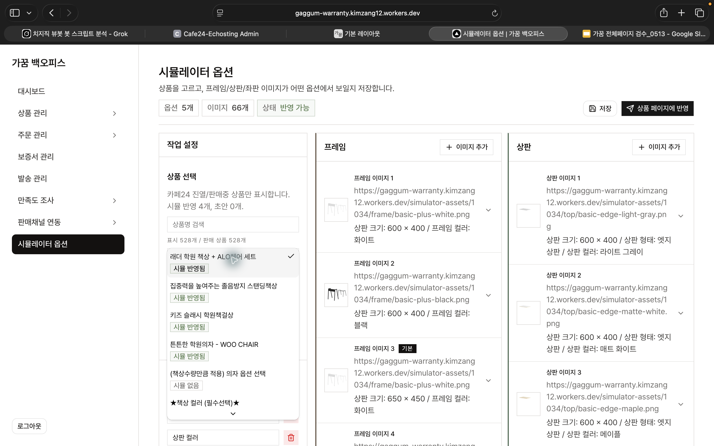
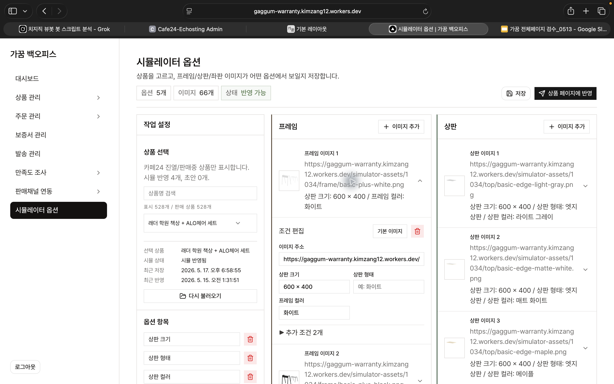

# 옵션 시뮬레이터 등록 설명서

> 작성일: 2026-05-18  
> 대상 화면: 가꿈 백오피스 > 시뮬레이터 옵션

## 한 줄 요약

상품을 선택하고, 이미지가 바뀌는 옵션 항목만 맞춰 넣은 뒤, 프레임/상판/좌판 이미지 조건을 등록합니다. `저장`은 초안 저장이고, 실제 상품상세 반영은 `상품 페이지에 반영` 버튼을 눌렀을 때만 됩니다.



## 1. 상품 선택

1. 백오피스에서 `시뮬레이터 옵션` 메뉴로 들어갑니다.
2. `상품명 검색`에 상품명을 입력합니다.
3. 상품 선택창에서 작업할 상품을 고릅니다.

상품 목록의 상태 표시는 아래처럼 보면 됩니다.

| 상태 | 의미 |
| --- | --- |
| 시뮬 반영됨 | 이미 상품상세에 반영된 시뮬레이터 데이터가 있음 |
| 초안 | 저장은 됐지만 아직 상품상세에는 반영하지 않음 |
| 시뮬 없음 | 아직 등록된 시뮬레이터 데이터가 없음 |



## 2. 옵션 항목 확인

`옵션 항목`에는 이미지 변화에 필요한 Cafe24 상품 옵션명만 넣습니다.

예시:

| 필요한 옵션 | 넣는 이유 |
| --- | --- |
| 상판 크기 | 상판/프레임 이미지 조건에 사용 |
| 상판 형태 | 상판 이미지 조건에 사용 |
| 상판 컬러 | 상판 이미지 조건에 사용 |
| 프레임 컬러 | 프레임 이미지 조건에 사용 |
| 좌판 컬러 | 좌판 이미지 조건에 사용 |

배송 방식, 수량, 설치 여부처럼 이미지가 바뀌지 않는 옵션은 넣지 않아도 됩니다. 옵션명과 옵션값은 Cafe24 상품상세에 보이는 문구와 띄어쓰기까지 맞추는 것이 가장 안전합니다.

## 3. 이미지 행 등록

이미지는 레이어별로 나눠 등록합니다.

| 영역 | 역할 |
| --- | --- |
| 프레임 | 책상 다리/프레임 이미지 |
| 상판 | 책상 상판 이미지 |
| 좌판 | 의자 좌판 또는 의자 컬러 이미지 |

각 영역의 `이미지 추가` 버튼을 누르면 새 이미지 행이 생깁니다. 기존 행을 클릭하면 아래처럼 조건 편집 영역이 펼쳐집니다.



## 4. 이미지 주소와 조건 입력

펼친 행에서 아래 항목을 입력합니다.

| 입력칸 | 입력 내용 |
| --- | --- |
| 이미지 주소 | 실제로 표시할 이미지 URL |
| 조건 입력칸 | 이 이미지가 보여야 하는 옵션값 |
| 기본 이미지 | 해당 영역의 기본값으로 쓸 이미지일 때 선택 |

예를 들어 프레임 이미지가 `상판 크기 600 x 400`, `프레임 컬러 화이트`에서 보여야 한다면 해당 조건칸에 그대로 입력합니다.

이미지 파일명은 가능하면 영문, 숫자, 하이픈만 사용합니다.

좋은 예:

```txt
frame/basic-plus-white.png
top/basic-edge-maple.png
seat/black.png
```

피해야 할 예:

```txt
프레임 화이트.png
top maple.png
seat(1).png
```

## 5. 저장과 상품상세 반영

작업 후에는 두 단계를 구분해서 진행합니다.

| 버튼 | 의미 |
| --- | --- |
| 저장 | 백오피스 초안 저장. 고객 상품상세는 아직 바뀌지 않음 |
| 상품 페이지에 반영 | 현재 저장된 내용을 고객 상품상세에 공개 반영 |

운영 순서는 아래처럼 진행합니다.

1. 상품을 선택합니다.
2. 옵션 항목을 확인합니다.
3. 프레임/상판/좌판 이미지 행을 등록하거나 수정합니다.
4. `저장`을 누릅니다.
5. 이상이 없으면 `상품 페이지에 반영`을 누릅니다.
6. 실제 상품상세에서 옵션을 바꿔 이미지가 바뀌는지 확인합니다.

## 6. 기존 FTP CSV 방식과의 관계

예전 방식은 Cafe24 FTP에 아래 구조로 이미지와 CSV를 올리는 방식이었습니다.

```txt
/web/upload/simulator/상품번호/
  simulator.csv
  frame/
  top/
  seat/
```

스킨 16의 현재 기준은 백오피스 API 데이터입니다. 백오피스에서 `상품 페이지에 반영`된 상품만 상품상세 시뮬레이터에 노출되며, FTP에 `simulator.csv`만 다시 올리는 방식은 기본 운영 경로가 아닙니다.

운영 기준은 아래처럼 잡는 것이 안전합니다.

| 상황 | 권장 작업 |
| --- | --- |
| 새 상품을 처음 등록 | 백오피스에서 상품 선택 후 직접 등록 |
| 이미 백오피스에 `시뮬 반영됨`으로 보임 | 백오피스에서 수정 후 다시 반영 |
| 예전 FTP CSV만 있는 상품 | 백오피스로 옮겨 등록 후 `상품 페이지에 반영` |

## 7. 최종 확인 체크리스트

반영 후 아래를 확인합니다.

- 상품 선택 영역에 `시뮬 반영됨` 상태가 표시되는지
- `이미지 주소`가 실제 브라우저에서 열리는지
- 옵션명과 옵션값이 Cafe24 상품상세 문구와 같은지
- 상품상세에서 옵션을 바꿨을 때 프레임/상판/좌판 이미지가 각각 바뀌는지
- PC와 모바일에서 깨진 이미지가 보이지 않는지

문제가 생기면 먼저 `다시 불러오기`로 백오피스 데이터를 새로 가져온 뒤, 필요한 행을 수정하고 `저장` 및 `상품 페이지에 반영`을 다시 진행합니다.
